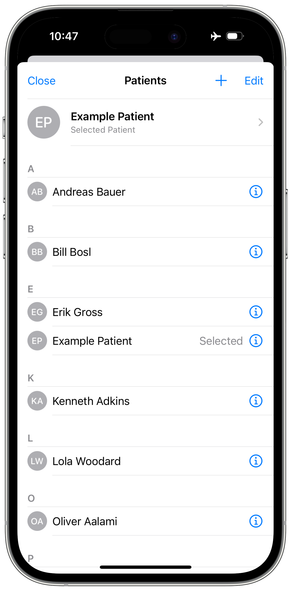

<!--

This source file is part of the Neurodevelopment Assessment and Monitoring System (NAMS) project

SPDX-FileCopyrightText: 2023 Stanford University

SPDX-License-Identifier: MIT

-->

# Neurodevelopment Assessment and Monitoring System (NAMS)

[](https://github.com/StanfordBDHG/NAMS/actions/workflows/beta-deployment.yml)
[](https://codecov.io/gh/StanfordBDHG/NAMS)
[](https://doi.org/10.5281/zenodo.8374397)

Neurodevelopment Assessment and Monitoring System (NAMS) iOS application.

> [!NOTE]  
> Do you want to try out the NeuroNest application? You can download it to your iOS device using [TestFlight](https://testflight.apple.com/join/aGVo1E1I)!

|<picture><source media="(prefers-color-scheme: dark)" srcset="Resources/NeuroNest-Home~dark.png"></picture>|<picture><source media="(prefers-color-scheme: dark)" srcset="Resources/NeuroNest-NearbyDevices~dark.png"></picture>|<picture><source media="(prefers-color-scheme: dark)" srcset="Resources/NeuroNest-Recording~dark.png"></picture>|<picture><source media="(prefers-color-scheme: dark)" srcset="Resources/NeuroNest-Questionnaire~dark.png"></picture>|
|:--:|:--:|:--:|:--:|
|NeuroNest Home view|Nearby Device Search|In Progress EEG Recording|Screening Questionnaires|

|<picture><source media="(prefers-color-scheme: dark)" srcset="Resources/NeuroNest-PatientList~dark.png"></picture>|<picture><source media="(prefers-color-scheme: dark)" srcset="Resources/NeuroNest-AddPatient~dark.png"></picture>|<picture><source media="(prefers-color-scheme: dark)" srcset="Resources/NeuroNest-ExamplePatient~dark.png"></picture>|
|:--:|:--:|:--:|
|Patient List|Adding a new patient|Patient Details|

NeuroNest is a software platform for EEG data collection and other neurodevelopmental evaluation of patients.
It connects to Bluetooth-enabled EEG devices to perform EEG recordings.
Currently, the app supports MUSE and BIOPOT 3 devices. 
Further, it integrates HL7 FHIR Questionnaires to perform standardized and clinically validated screening questionnaires.

Through an integration with Firebase, EEG recordings and questionnaire results can be used for further processing
and analysis, facilitating novel, algorithm-based approaches to neurodevelopmental risk assessment.

### Muse SDK

The project supports Muse EEG Headbands to collect EEG recordings.

The Muse SDK is closed-source and, therefore, not part of this repository.
For more information, refer to the [Muse SDK FAQ](https://choosemuse.my.site.com/s/article/Muse-Software-Development-Kit-SDK-FAQs?language=en_US) page.
If you have access, you may need to fetch the git submodule by running the following command:
```shell
git submodule update --init
```

The Xcode project configures two targets:
* `NAMS`: This target uses a Mock Device Layer and does not include the Muse SDK. It is useful for demonstration and testing purposes. 
* `NAMS Muse` This target includes the Muse SDK. It does not build on the iOS Simulator.

## Build and Run the Application

You can build and run the application using [Xcode](https://developer.apple.com/xcode/) by opening up the **NAMS.xcodeproj**.

The application provides a [Firebase Firestore](https://firebase.google.com/docs/firestore)-based data upload and [Firebase Authentication](https://firebase.google.com/docs/auth) login & sign-up.
It is required to have the [Firebase Emulator Suite](https://firebase.google.com/docs/emulator-suite) to be up and running to use these features to build and test the application locally.
Please follow the [installation instructions](https://firebase.google.com/docs/emulator-suite/install_and_configure). 

You do not have to make any modifications to the Firebase configuration, login into the `firebase` CLI using your Google account, or create a project in firebase to run, build, and test the application!

Startup the [Firebase Emulator Suite](https://firebase.google.com/docs/emulator-suite) using
```
$ firebase emulators:start
```

After the emulators have started up, you can run the application in your simulator to build, test, and run the application.

The application includes the following feature flags that can be configured in the [scheme editor in Xcode](https://help.apple.com/xcode/mac/11.4/index.html?localePath=en.lproj#/dev0bee46f46) and selecting the **NAMS** scheme, the **Run** configuration, and to switch to the **Arguments** tab to add, enable, disable, or remove the following arguments passed on launch:
- ``--skipOnboarding``: Skips the onboarding flow to enable easier development of features in the application and to allow UI tests to skip the onboarding flow.
- ``--showOnboarding``: Always show the onboarding when the application is launched. Makes it easy to modify and test the onboarding flow without the need to manually remove the application or reset the simulator.
- ``--useFirebaseEmulator``: Defines if the application should connect to the local firebase emulator. Always set to true when using the iOS simulator.
- ``--inject-default-patient``: Automatically create and select a default patient (useful for testing).

## Contributors & License

This project is based on [ContinuousDelivery Example by Paul Schmiedmayer](https://github.com/PSchmiedmayer/ContinousDelivery), and the [Neurodevelopment Assessment and Monitoring System (NAMS)](https://github.com/StanfordBDHG/NAMS) provided using the MIT license.
You can find a list of contributors in the `CONTRIBUTORS.md` file.

The Neurodevelopment Assessment and Monitoring System (NAMS) and the Spezi framework are licensed under the MIT license.
